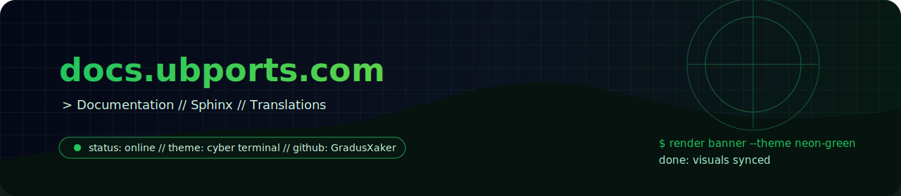

<div align="center">
  

  <h1>docs.ubports.com</h1>
  <p><strong>Документация UBports в едином рабочем репозитории.</strong> Исходники сайта, сборка, переводы и документационный workflow.</p>

  <p>
    
    
    
    
  </p>
</div>

```text
> repo: docs.ubports.com
> pipeline: build docs / update translations / publish site
> role: source of truth for UBports documentation
```

## обзор

Этот репозиторий нужен для сборки и сопровождения сайта документации `UBports`, включая локальную сборку, обновление переводов и документированный процесс внесения изменений.

### Как вносить изменения

Правила и рекомендации по участию описаны здесь:
- https://docs.ubports.com/en/latest/contribute/documentation.html

Перед отправкой изменений лучше придерживаться всех требований с этой страницы, иначе вклад могут не принять.

### Сборка документации

Собрать документацию можно командой из корня репозитория:

```bash
./build.sh
```

Скрипт также создаст виртуальное окружение в `~/ubportsdocsenv`, если его еще нет.

После завершения сборки открыть результат можно локально, например так:

```bash
firefox _build/html/index.html
```

### Обновление переводов

Чтобы обновить `.po`-файлы переводов, выполните:

```bash
./update-translations.sh
```

Чтобы добавить новый язык, внесите его ISO-код в `languagues.sh`, а затем снова запустите:

```bash
./update-translations.sh
```

## контакты

<p>
  <a href="https://github.com/GradusXaker"></a>
  <a href="https://vk.com/gradus_xaker"></a>
  <a href="mailto:gradus_xaker@mail.ru"></a>
</p>

